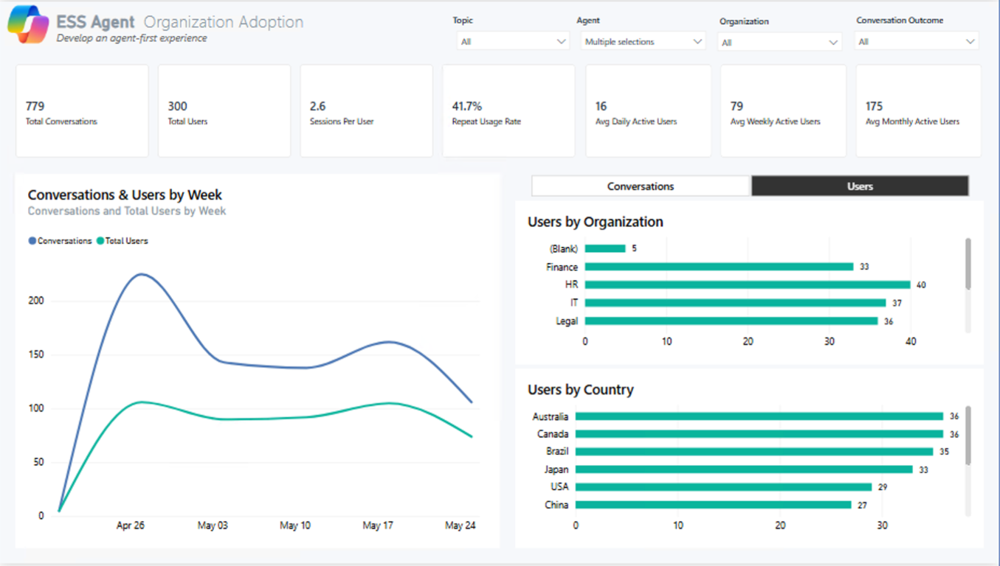
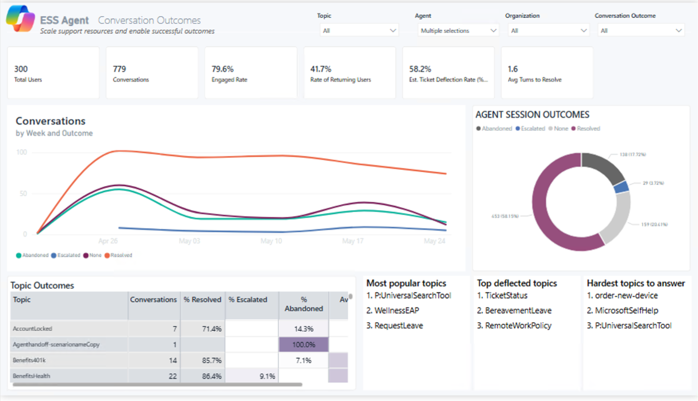
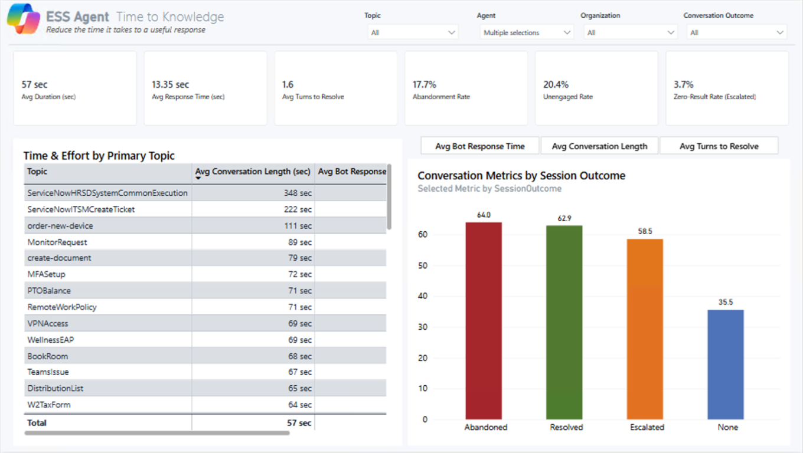
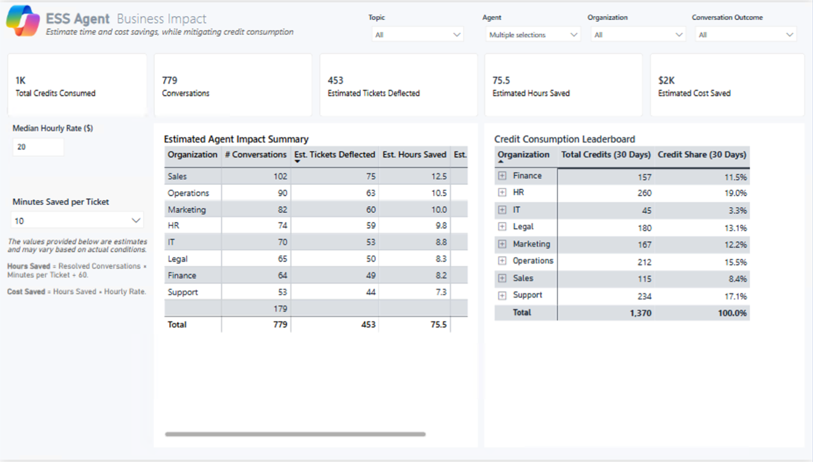
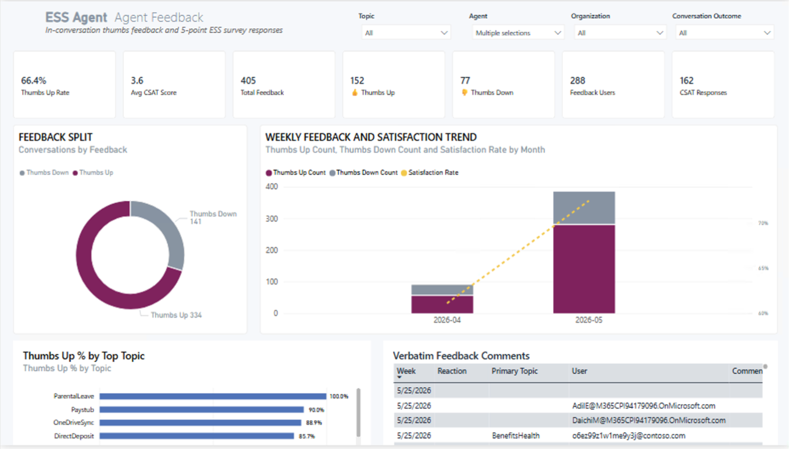
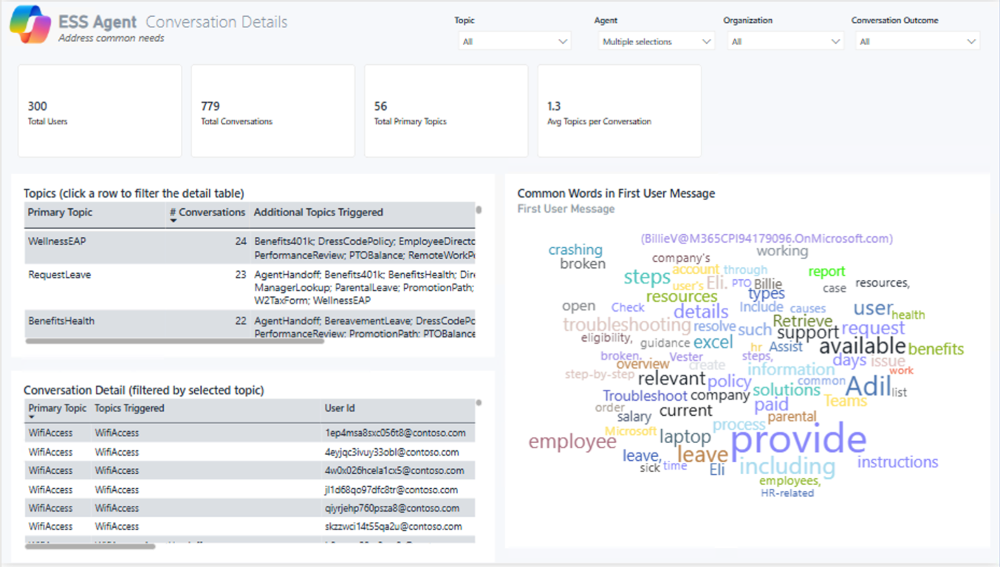
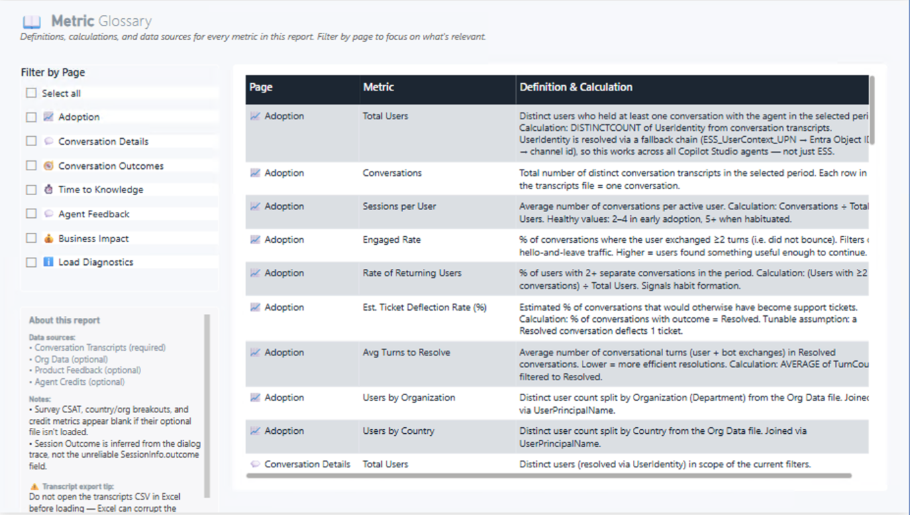

# ESS Insights — Employee Self-Service Agent Analytics

> **Measure the real-world impact of your Microsoft Employee Self-Service (ESS) Copilot Studio agent — adoption, outcomes, deflection, and user feedback — using only the data your agent already produces.**

A drop-in Power BI template purpose-built for the **Microsoft ESS agent**, with a 7-page executive dashboard that answers the questions HR, IT, and the executive sponsor will actually ask after launch.

> 💡 Built for ESS, but works for **any Copilot Studio agent** — the same template will load and analyze transcripts from any agent (HR, IT, sales enablement, custom). See [Customize for your agent](#customize-for-your-agent).

---

## What the dashboard looks like

| | |
|---|---|
|  |  |
| **1 — Organization Adoption** | **2 — Conversation Outcomes** |
|  |  |
| **3 — Time to Knowledge** | **4 — Business Impact** |
|  |  |
| **5 — Agent Feedback** | **6 — Conversation Details** |
|  | |
| **7 — Metric Glossary** | |

---

## Why use this template for your ESS agent

The Microsoft ESS agent gives your employees a single, conversational front door to HR, IT, payroll, benefits, and travel self-service. But the platform gives you *transcripts*, not insights. This template answers the questions an ESS program owner needs to answer every month:

- **Are employees adopting it?** Distinct users, repeat usage, DAU/WAU/MAU trend
- **Is it actually resolving their requests?** Resolution vs. escalation vs. abandonment rates, by topic
- **How fast does it answer?** Avg duration, response time, turns to resolve
- **What is it saving the business?** Tickets deflected, hours saved, dollar value, credit cost
- **Are employees happy with it?** In-conversation thumbs, CSAT, verbatim comments
- **Which intents need authoring help?** Per-topic deflection, abandonment, and outcomes

All seven pages light up from a single Dataverse export. Add optional companion files to unlock organization/country breakouts, satisfaction scores, and credit cost analysis.

---

## What you get

| Page | What it answers |
|---|---|
| 📈 **Organization Adoption** | Volume, distinct users, repeat-usage rate, DAU/WAU/MAU, breakdown by Org & Country |
| 🎯 **Conversation Outcomes** | Resolution / escalation / abandonment trend, topic outcomes, top deflected topics |
| ⏱ **Time to Knowledge** | Avg duration, response time, turns to resolve, abandonment & unengaged rate |
| 💼 **Business Impact** | Tickets deflected, hours saved, $ saved, credit-consumption leaderboard |
| �� **Agent Feedback** | In-conversation thumbs, CSAT, verbatim comments, satisfaction trend |
| 💬 **Conversation Details** | Per-topic drill-through with full transcripts and a first-message word cloud |
| 📖 **Metric Glossary** | Every metric defined, calculated, and sourced — no black boxes |

---

## Quick start

1. **Download** [`ESS Dashboard Template.pbit`](./ESS%20Dashboard%20Template.pbit) from this repo.
2. **Export your conversation transcripts** from the Dataverse environment that hosts your ESS agent (the only required file).
3. **Open the .pbit** in Power BI Desktop. When prompted, paste the full path to your transcripts CSV and click **Load**.
4. **Done.** All 7 pages populate from that one file. Optional companion files unlock breakouts (see below).

📘 **Full step-by-step instructions:** [SETUP.md](./SETUP.md)

---

## Data inputs

| File | Required? | Unlocks |
|---|---|---|
| **Conversation Transcripts** (Dataverse export from your ESS environment) | ✅ Required | All adoption, outcomes, time-to-knowledge, and conversation-detail metrics |
| **Org Data** (HR roster CSV: UPN, Department, JobTitle, Country) | ⭐ Recommended | "Users by Organization" and "Users by Country" breakouts on every page |
| **Product Feedback** (Dataverse export) | Optional | Thumbs up/down, CSAT, verbatim comments page |
| **Agent Credits** (Copilot Studio usage export) | Optional | Credit consumption leaderboard and Business Impact page |

> The template **will load and render every page without errors** even if you provide only the required transcripts file. Optional pages and breakouts will show blank where data is missing — by design, so you can start with the minimum and add more later.

---

## Validation & troubleshooting

| Symptom | Likely cause | Fix |
|---|---|---|
| "M Engine error: Token Identifier expected" on open | CSV opened in Excel before loading; Excel corrupted the JSON columns | Re-export from Dataverse, do **not** open in Excel, load directly into Power BI |
| Total Users count looks wrong | Same employee appears under both UPN and Entra Object ID in your transcripts | This is handled automatically — both identities are cross-walked in the model |
| "Users by Organization" chart shows only (Blank) | Org Data file not loaded, or UPN format doesn't match | Set the **Org Data File** parameter (Transform data → Edit Parameters); ensure the column is named `UserPrincipalName` |
| "Users by Country" chart shows "Something's wrong with one or more fields" | Your Org Data CSV is missing the Country column | Add a `Country` column to your Org Data file (it can be empty), or re-download the latest template |
| Repeat-usage rate is 0% | Period is too short (everyone is a first-time user) | Widen the date filter, or wait for more data |

Full validation checklist: [SETUP.md § Validation](./SETUP.md#step-5--validation)

---

## Customize for your agent

While this template is purpose-built for the Microsoft ESS agent, the underlying data model works against **any Copilot Studio agent's transcripts**. To use it for a different agent (HR-only, IT helpdesk, sales enablement, custom internal agent):

1. Point the **Transcript File** parameter at that agent's Dataverse export.
2. Open the **Adoption** page → click the title text box → replace "ESS Agent" with your agent name.
3. (Optional) Open the **Metric Glossary** page → update the "About this report" callout.
4. Save as a new `.pbit` and re-distribute to your stakeholders.

No semantic-model edits required.

---

## Distribute to your stakeholders

- **Publish to Power BI Service** for a live, refreshable workspace report.
- **Export to PDF** for monthly executive updates.
- **Pin individual visuals** to a Teams dashboard for daily monitoring.

---

## Storytelling tips

When presenting these numbers to a non-technical audience:

- **Lead with Business Impact, not Adoption.** Hours saved and tickets deflected resonate more than DAU with an exec sponsor.
- **Pair Outcomes with Topic Outcomes.** A 79% engagement rate means nothing without knowing *which* topics drove it.
- **Use Verbatim Feedback as proof.** Two quotes from real employees beats a 4.1/5 CSAT score every time.
- **Show the trend, not the snapshot.** The weekly trend visuals are your story arc — start there.

---

## Contributing & feedback

Found a bug? Have a feature request? [Open an issue](https://github.com/downeysteph/ESS-Insights/issues) — feedback from real ESS customers makes this template better for everyone.

---

## License

[MIT](./LICENSE) — use it, modify it, ship it, share it.
