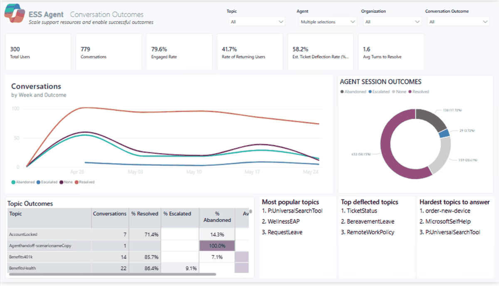

# ESS Insights — Employee Self-Service Agent Analytics

> **Measure the real-world impact of your Microsoft Employee Self-Service (ESS) Copilot Studio agent — adoption, outcomes, deflection, and user feedback — using only the data your agent already produces.**

A drop-in Power BI template purpose-built for the **Microsoft ESS agent**, with a 7-page executive dashboard that answers the questions HR, IT, and the executive sponsor will actually ask after launch.

> 💡 Built for ESS, but works for **any Copilot Studio agent** — the same template will load and analyze transcripts from any agent (HR, IT, sales enablement, custom). See [Customize for your agent](#customize-for-your-agent).

---

## Why use this template for your ESS agent

The Microsoft ESS agent gives your employees a single, conversational front door to HR, IT, payroll, benefits, and travel self-service. But the platform gives you *nested data*, not insights. This template answers the questions an ESS program owner needs to answer every month:

- **Are employees adopting it?** Distinct users, repeat usage, DAU/WAU/MAU trend
- **Is it actually resolving their requests?** Resolution vs. escalation vs. abandonment rates, by topic
- **How fast does it answer?** Avg duration, response time, turns to resolve
- **What is it saving the business?** Tickets deflected, hours saved, dollar value, credit cost
- **Are employees happy with it?** In-conversation thumbs, CSAT, verbatim comments
- **Which intents need authoring help?** Per-topic deflection, abandonment, and outcomes

All seven pages light up from a single Power Platform export. Add optional companion files to unlock organization/country breakouts, satisfaction scores, and credit cost analysis.

---

## What you get

| # | Page | What it answers |
|---|---|---|
| 1 | **Conversation Outcomes** | Resolution / escalation / abandonment trend, topic outcomes, top deflected topics |
| 2 | **Time to Knowledge** | Avg duration, response time, turns to resolve, abandonment & unengaged rate |
| 3 | **Organization Adoption** | Volume, distinct users, repeat-usage rate, DAU/WAU/MAU, breakdown by Org & Country |
| 4 | **Conversation Details** | Per-topic drill-through with full transcripts and a first-message word cloud |
| 5 | **Agent Feedback** | In-conversation thumbs, CSAT, verbatim comments, satisfaction trend |
| 6 | **Business Impact** | Tickets deflected, hours saved, $ saved, credit-consumption leaderboard |
| 7 | **Metric Glossary** | Every metric defined, calculated, and sourced — no black boxes |

---

## Before you start — Prerequisites

Before you run the dashboard against a real agent, walk through this checklist. 

### 1. Power BI Desktop installed

- **Required.** The `.pbit` template opens in Power BI Desktop on **Windows only**. Mac users need a Windows VM or Parallels.
- **Download:** [Download PowerBI for free](https://www.microsoft.com/en-us/download/details.aspx?id=58494&msockid=2488193a4d40616c33750f9a4c3760f0)(Download PBI) (free) or install from the Microsoft Store.
- **Version:** Any release from the last 6 months. The template uses standard connectors only.

### 2. Permission roles

Different parts of the dashboard need different roles. Confirm the right person has the right access **before** the working session.

| Data | Required role(s) | Where assigned |
|---|---|---|
| **Conversation transcripts** (CSV Upload path) | **System Administrator**, **System Customizer**, or **Bot Transcript Viewer** on the Dataverse environment hosting the agent | Power Platform Admin Center → Environment → Settings → Users + permissions → Security roles |
| **Conversation transcripts** (Dataverse Direct path) | Same as above — **Bot Transcript Viewer** is the minimum | Same as above |
| **Org Data CSV** *(recommended)* | **Global Reader**, **User Administrator**, or **Global Administrator** | Microsoft 365 Admin Center → Roles |
| **Agent Credits CSV** *(optional)* | **Copilot Studio Administrator** for the agent's environment | Copilot Studio → agent → Settings → Permissions |
| **Verifying transcripts in Dataverse** | **Environment Maker** + ability to read the `bot` and `conversationtranscript` tables | Same as transcripts above |
| **Extending Dataverse retention** *(see §4)* | **System Administrator** on the environment | Power Platform Admin Center |

> ⚠️ `Environment Maker` alone is **not enough** to read transcripts. Customers often have this and assume they're covered — they aren't.

### 3. Supported environment types

Copilot Studio agents can live in different environment types. **Only some of them persist transcripts to Dataverse** — which is what this dashboard reads.

| Environment type | Transcripts written to Dataverse? | Use with this dashboard? |
|---|---|---|
| **Production** | ✅ Yes | ✅ Yes |
| **Sandbox** | ✅ Yes | ✅ Yes |
| **Default** *(per-tenant)* | ✅ Yes | ✅ Yes |
| **Developer** *(per-user)* | ⚠️ Yes, but only your own conversations | ⚠️ Demo only — not multi-user analytics |
| **Microsoft Teams environment** | ❌ No — transcripts are not persisted | ❌ Not supported |
| **Microsoft 365 Copilot environment** | ❌ No | ❌ Not supported |

**How to check your environment type:**
1. Power Platform Admin Center → **Environments** → click the env hosting the agent.
2. The **Type** column (or the env detail page) shows Production / Sandbox / Default / Developer / Teams.
3. If it's Teams or M365 Copilot, the agent needs to be **moved or republished** to a Production or Sandbox env to enable transcript analytics.

### 4. Agent configuration

These toggles control **what** gets written to the transcript. With them off, transcripts are still saved, but most dashboard metrics will look blank.

#### a) Enable conversation transcripts

1. Open the agent in [Copilot Studio](https://copilotstudio.microsoft.com).
2. **Settings** (top right) → **Advanced** → **Conversation transcripts**.
3. Confirm **"Save conversation transcripts to Dataverse"** is **ON**.
4. **Save / publish** the agent.

#### b) Include node-level details *(critical for this dashboard)*

1. Same Settings page → scroll to **Enhance Transcripts**.
2. Turn **"Include node-level details in transcripts"** **ON**.
3. **Save / publish** the agent.

> Without this, the dashboard's topic detection, turn counts, durations, and outcome classification will all be blank.

#### c) Don't conceal user names *(only matters if you want per-user analytics)*

1. Microsoft 365 Admin Center → **Settings** → **Org settings** → **Reports**.
2. **Uncheck** "Display concealed user names in all reports."
3. Otherwise UPNs in transcripts come back as anonymized hashes and Org Data joins will fail.

> ⏱ **Important:** These settings only affect **future** conversations. Historical transcripts written while a toggle was off won't backfill. Run a few test conversations after enabling them, wait 2–5 minutes, then refresh the dashboard.

### 5. Dataverse retention window

By default, Dataverse **automatically deletes conversation transcripts after 30 days** via a system bulk-deletion job. If you want a longer history window:

**Option A — Extend retention via the Copilot Studio agent setting**
1. Copilot Studio → agent → **Settings** → **Advanced** → **Conversation transcripts**.
2. Set **"Number of days to retain transcripts"** to the desired value (max varies by tenant; commonly up to 365).
3. **Save / publish**.

**Option B — Modify the Dataverse bulk-delete job** *(requires System Administrator)*
1. Power Platform Admin Center → **Environments** → click the env → **Settings** → **Data management** → **Bulk record deletion**.
2. Find the recurring job named something like **"Bulk delete conversation transcripts older than 30 days"**.
3. **Edit** → change the date filter (e.g. `older than 90 days`) or **deactivate** the job.
4. **Save**.

> 💡 **Plan ahead.** If a customer wants 12 months of trend in the dashboard, retention must already have been extended **12 months ago**. You can't backfill deleted transcripts.

📖 **Learn more:** [Manage conversation transcript retention — Microsoft Learn](https://learn.microsoft.com/en-us/microsoft-copilot-studio/analytics-transcripts-powerapps)

---

## Quick start — choose your path

This dashboard ships in **two flavors**. Pick the one that matches how you want to refresh your data:

| | 📄 **CSV Upload** | 🔌 **Dataverse Direct** |
|---|---|---|
| **How it loads data** | You export `ConversationTranscript` to CSV, then point the template at the file | The template connects live to your Dataverse environment via the native Power BI connector |
| **Setup time** | ~10 min | ~5 min |
| **Refresh** | Re-export the CSV, drop it at the same path, click Refresh | One click — pulls live from Dataverse |
| **Power BI Service refresh** | Needs a **Gateway** pointing at the CSV folder | **No Gateway** — cloud-to-cloud |
| **Who can run it** | Anyone who can run the Dataverse export | Anyone with the **Bot Transcript Viewer** role on the environment |
| **Lookback control** | Whatever the export window allows (default 30 days) | Parameter — pull 30 / 90 / 365 days at will |
| **Best for** | One-off snapshots, demos, sharing with people outside the tenant | Production dashboards, scheduled refresh, ongoing monitoring |
| **Get the template** | [`ESS Dashboard Template 1.2 (CSV Upload).pbit`](./ESS%20Dashboard%20Template%201.2%20(CSV%20Upload).pbit) | [`ESS Dashboard Template 1.2 (Dataverse).pbit`](./ESS%20Dashboard%20Template%201.2%20(Dataverse).pbit) |
| **Setup guide** | 📘 **[Written Setup Guide — CSV Upload](./SETUP-CSV-Download.md)** | 📘 **[Written Setup Guide — Dataverse Direct](./SETUP-Dataverse.md)** |

> 💡 **Not sure?** If this is your first time exploring the dashboard, start with **CSV Upload** — no tenant permissions needed beyond running the Dataverse export. Move to **Dataverse Direct** once you're ready to put the dashboard in front of stakeholders on a schedule.

---

## Data inputs

| File | Required? | Unlocks |
|---|---|---|
| **Conversation Transcripts** (Dataverse export from your ESS environment) | ✅ Required | All adoption, outcomes, time-to-knowledge, and in-conversation thumbs/CSAT feedback |
| **Org Data** (HR roster CSV: UPN, Department, JobTitle, Country) | ⭐ Recommended | "Users by Organization" and "Users by Country" breakouts on every page |
| **Agent Credits** (Copilot Studio usage export) | Optional | Credit consumption leaderboard and Business Impact page |

> The template **will load and render every page without errors** even if you provide only the required transcripts file. Optional pages and breakouts will show blank where data is missing — by design, so you can start with the minimum and add more later.

---

## Validation & troubleshooting

| Symptom | Likely cause | Fix |
|---|---|---|
| "M Engine error: Token Identifier expected" on open | CSV opened in Excel before loading; Excel corrupted the JSON columns | Re-export from Dataverse, do **not** open in Excel, load directly into Power BI |
| Total Users count looks wrong | Same employee appears under both UPN and Entra Object ID in your transcripts | This is handled automatically — both identities are cross-walked in the model |
| "Users by Organization" chart shows only (Blank) | Org Data file not loaded, or UPN format doesn't match | Set the **Org Data File** parameter (Transform data → Edit Parameters); ensure the column is named `UserPrincipalName` |
| "Users by Country" chart shows "Something's wrong with one or more fields" | Your Org Data CSV is missing the Country column | Add a `Country` column to your Org Data file (it can be empty), or re-download the latest template |
| Repeat-usage rate is 0% | Period is too short (everyone is a first-time user) | Widen the date filter, or wait for more data |

Full validation checklist: see the **Validate before sharing** step in either setup guide ([CSV Upload](./SETUP-CSV-Download.md#step-6--validate-before-sharing) &middot; [Dataverse Direct](./SETUP-Dataverse.md#step-7--validate-before-sharing)).

---

## Customize for your agent

While this template is purpose-built for the Microsoft ESS agent, the underlying data model works against **any Copilot Studio agent's transcripts**. To use it for a different agent (HR-only, IT helpdesk, sales enablement, custom internal agent):

1. Point the **Transcript File** parameter at that agent's Dataverse export.
2. Open the **Adoption** page → click the title text box → replace "ESS Agent" with your agent name.
3. (Optional) Open the **Metric Glossary** page → update the "About this report" callout.
4. Save as a new `.pbit` and re-distribute to your stakeholders.

No semantic-model edits required.

---

## Distribute to your stakeholders

- **Publish to Power BI Service** for a live, refreshable workspace report.
- **Export to PDF** for monthly executive updates.
- **Pin individual visuals** to a Teams dashboard for daily monitoring.

---

## Storytelling tips

When presenting these numbers to a non-technical audience:

- **Lead with Business Impact, not Adoption.** Hours saved and tickets deflected resonate more than DAU with an exec sponsor.
- **Pair Outcomes with Topic Outcomes.** A 79% engagement rate means nothing without knowing *which* topics drove it.
- **Use Verbatim Feedback as proof.** Two quotes from real employees beats a 4.1/5 CSAT score every time.
- **Show the trend, not the snapshot.** The weekly trend visuals are your story arc — start there.

---

## Contributing & feedback

Found a bug? Have a feature request? [Open an issue](https://github.com/downeysteph/ESS-Insights/issues) — feedback from real ESS customers makes this template better for everyone.

---

## License

[MIT](./LICENSE) — use it, modify it, ship it, share it.
